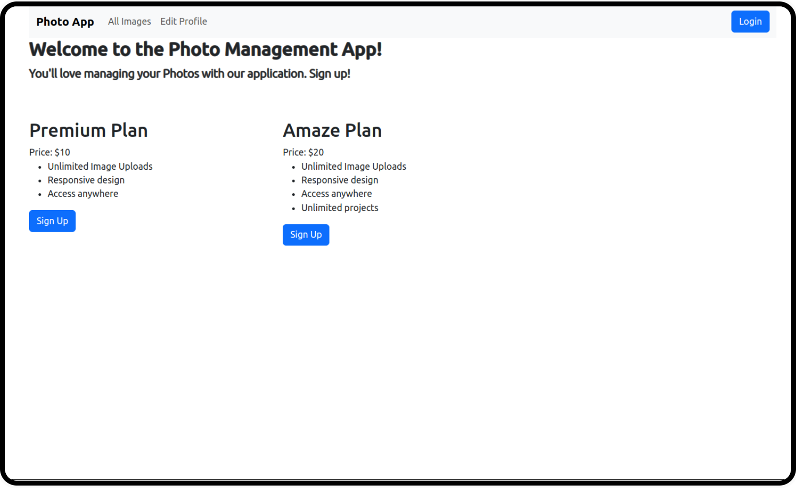
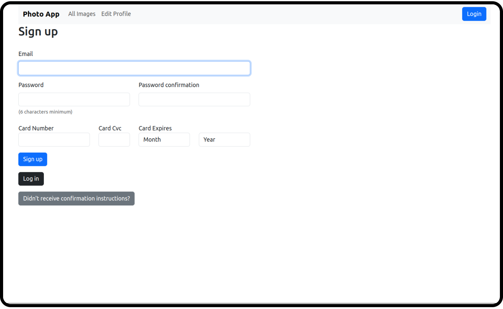
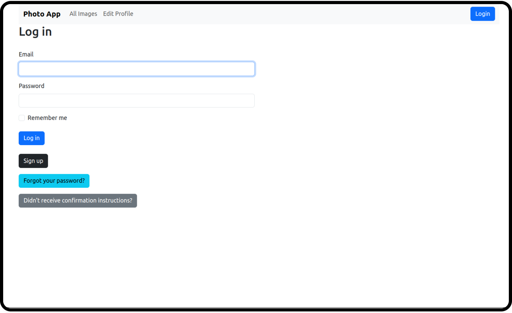
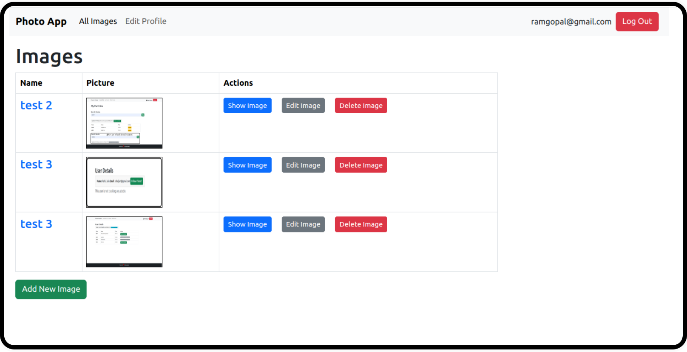
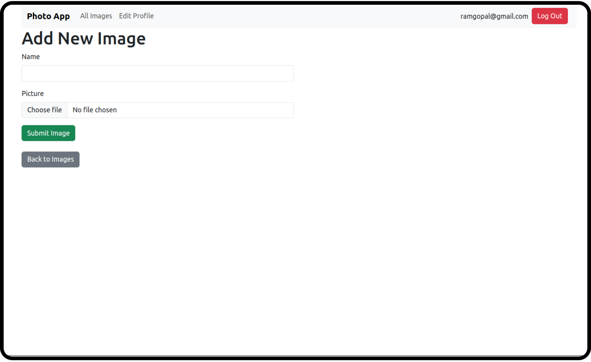
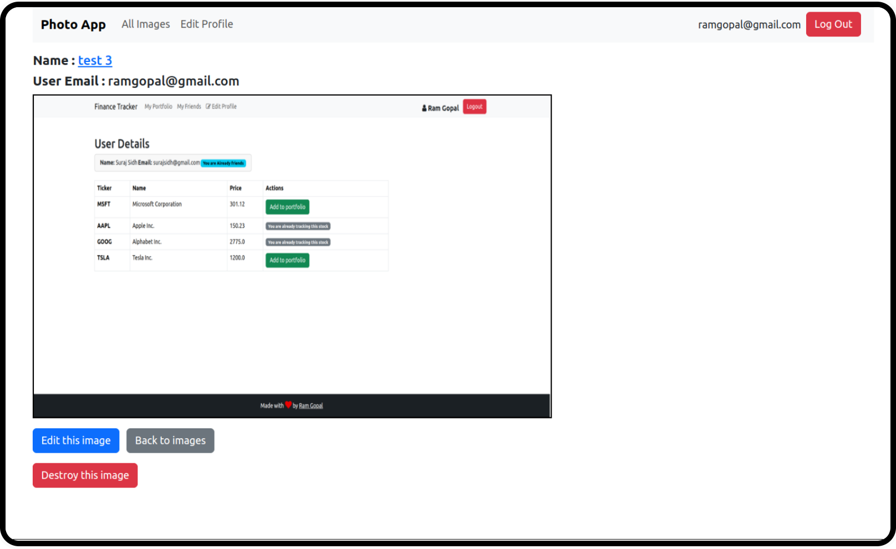
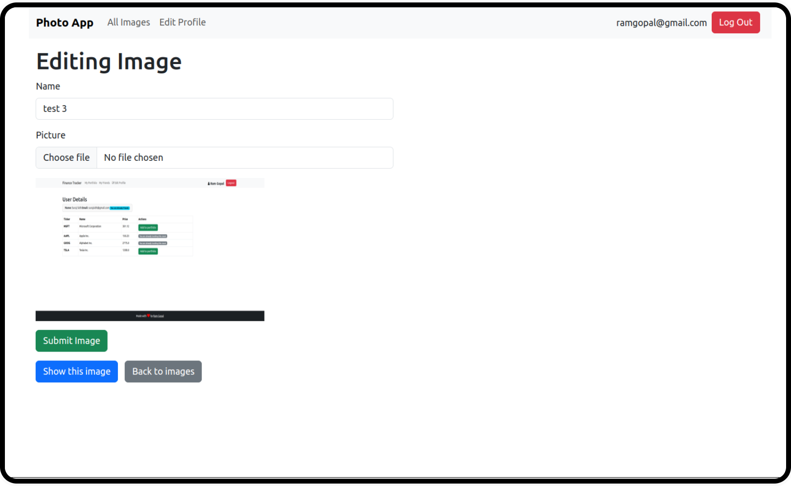
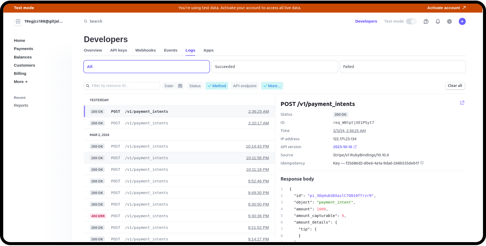
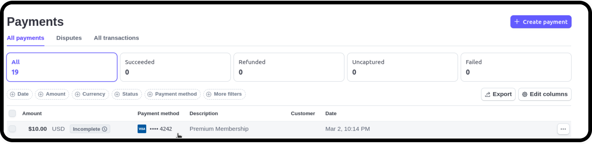

## Screenshots

#### Home page without login/signup
  

#### Sign up page
  

#### Log in page
  

#### Images Home page
  

#### Sign up page
  

#### Show Image page
  

#### Edit Image page
  

#### Stripe Log
  

#### Stripe Log
  

# README

This README would normally document whatever steps are necessary to get the
application up and running.

Things you may want to cover:

* Configuration

* Database creation

* Database initialization

* How to run the test suite

* Services (job queues, cache servers, search engines, etc.)

* Deployment instructions

* ...
